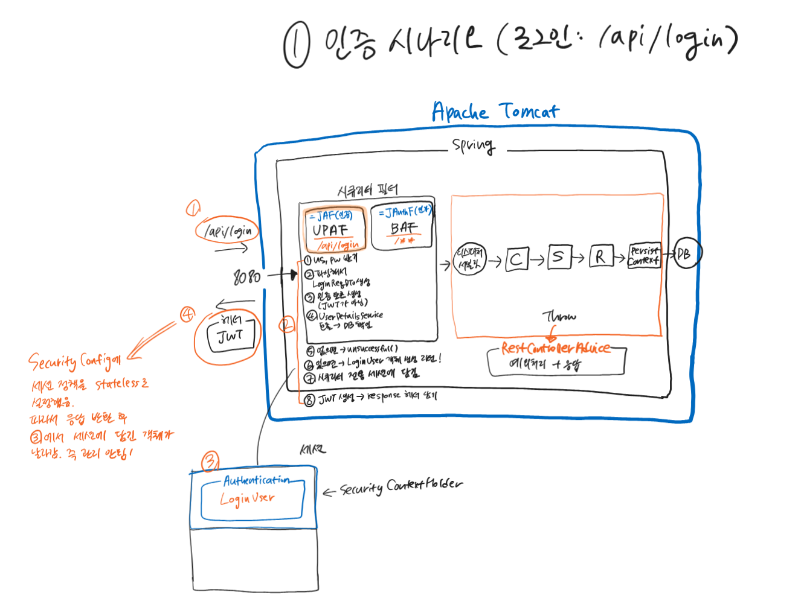
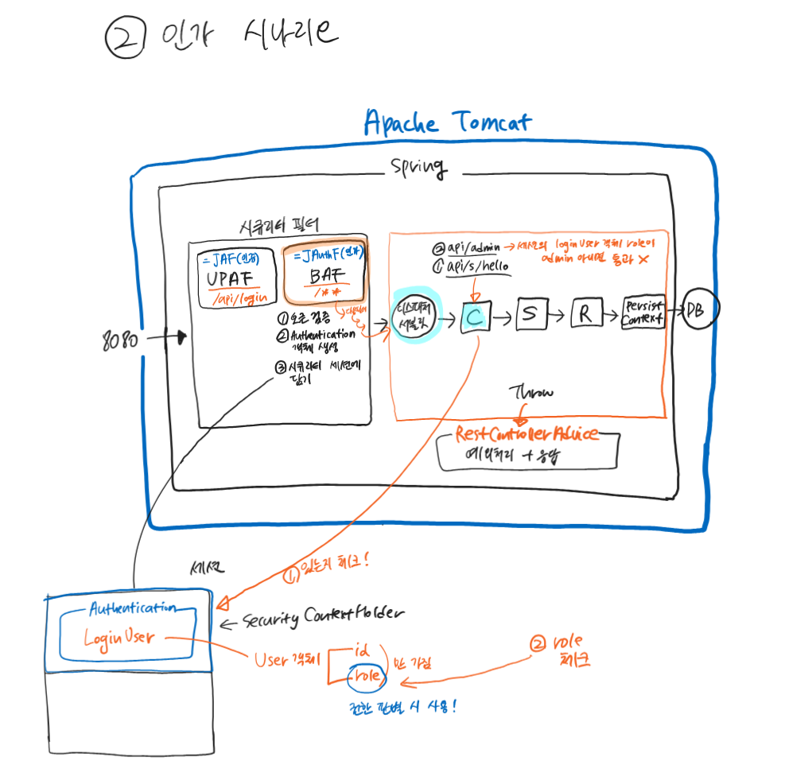

# Junit Bank App

### Jpa LodcalDateTime 자동으로 생성하는 법
- @EnableJpaAuditing (Main 클래스에)
- @EntityListeners(AuditingEntityListener.class) (Entity 클래스에)
```java
    @CreatedDate // insert 할 때
    @Column(nullable = false)
    private LocalDateTime createdAt;

    @LastModifiedDate // insert, update 할 때
    @Column(nullable = false)
    private LocalDateTime updatedAt;
```

### @NoArgsConstructor 사용 이유
- 모든 엔티티는 기본 생성자를 가져야 함!
  - JPA 구현체가 객체를 프록시로 생성하거나, DB로부터 조회하여 객체를 복구할 때 필요
- access level은 protected로 설정하자
  - private으로 하면 지연 로딩 시 JPA 구현체가 프록시 생성 못함

### Jnuit 테스트 
- Mock 환경에서 테스트 할 시 WebEnvironment.MOCK으로 설정해주자
``` java
@AutoConfigureMockMvc //Mock(가짜) 환경에 MockMv가 등록됨
@SpringBootTest(webEnvironment = SpringBootTest.WebEnvironment.MOCK)
public class SecurityConfigTest {

    //가짜 환경에 등록된 MockMvc를 DI
    @Autowired
    private MockMvc mvc;
```

### 서버는 일관성 있게 에러가 리턴 되어야 한다.
- 내가 모르는 에러가 프론트한테 날라가지 않게 직접 다 제어하자 (CustomResponseUtil로 관리)
  - 인증 실패 예외 처리 커스텀 
  - 권한 실패 예외 처리 커스텀

### Spring AOP
  - **공통으로 사용되는 코드를 분리하여 관리** -> 코드 재사용성 관리 편의성 향상
  - @Aspect: : 클래스가 AOP 관점을 정의하고 있음을 나타내는 어노테이션
  - @Pointcut : 특정 조건에 맞는 조인 포인트(프로그램 실행 중 특정 위치)를 식별하는 데 사용
  - @Advice : 특정 조인 포인트에서 Aspect에 의해 취해질 조치. 종류로는 Before, After, AfterReturning, AfterThrowing, Around 등이 있음
    - @Around : 정의된 포인트컷에 대해 실제 메서드 전후로 추가 로직을 실행하도록 지정
  - ex) validationAdvice 메서드에서 컨트롤러 메서드의 매개변수들을 순회하며 BindingResult 타입 인스턴스를 찾으며 유효성 검사 수행

### 컨트롤러는 DTO의 유효성 검사를 수행해야 한다!!
  - 서비스는 유효성 검사를 하지 않기 때문에 유효성 검증이 안된 DTO를 레포지토리에서 엔티티로 바꿔서 DB에 넣으면 DataException이 발생한다
    - ex) User의 email 필드가 20자 제한 걸려 있는데 컨트롤러가 유효 검사를 안하면 DB 에러 발생
  - @Valid, @Validated, 정규 표현식을 사용한 검증 등을 통해 유효성 검사 가능
    - @Digits(integer=, fraction=) : long 검증할 때 사용. integer는 허용되는 최대 정수 자릿수, fraction은 허용되는 최대 소수 자릿수

### DTO 정규 표현식 검증 적용하기
  - @Pattern : 문자열 필드가 정규 표현식에 정의된 패턴과 일치하는 지 검사하는 데 사용. 특정 필드에 대한 입력 형식을 엄격하게 제어 가능
```java
@Pattern(regexp = "^[a-zA-Z가-힣]{1,20}$", message = "한글/영문 1~20자 이내로 작성해주세요")
private String fullName;
```
  - regexp : 검사할 문자열이 일치해야 하는 정규 표현식
  - message : 유효성 검사를 통과하지 못할 경우 반환될 에러 메시지

### JwtAuthenticationFilter
  - 커스텀한 인증 필터 : /api/login 경로에서 실행
  - 구조 & 시나리오
    
### JwtAuthorizationFilter
  - 커스텀한 인가 필터 : 모든 경로에서 실행
  - 구조 & 시나리오
    
### @WithUserDetails
  - 로그인된 사용자만 사용할 수 있는 기능 테스트 시 사용
  - UserDetailsService가 구현하는 객체가 있는지 DB에서 조회하고, 있다면 그 객체를 시큐티리 세션에 담아준다
  - 만약 BeforeEach로 DB에 값을 세팅해주고 있다면, setupBefore = TestExecutionEvent.TEST_EXECUTION를 설정해서 BeforeEach를 통한 셋업이 수행된 후에 @WithUserDetails가 동작하게 해줘야 함
### 명시적으로 파라미터 이름 지정 (@PathVariable)
  - Name for argument of type [java.lang.Long] not specified, and parameter name information not available via reflection : 메서드 인자의 이름을 찾을 수 없다는 에러
  - @PathVariable에서 파라미터 이름을 명시적으로 지정 안해서 발생. Spring은 메서드 호출 시 리플렉션을 통해 파라미터 이름을 사용해 인자를 매핑함. 만약 컴파일 시 파라미터 이름이 보존되지 않으면 기본적으로, arg0이나 arg1같은 이름을 사용함
  - 프로젝트 컴파일 설정에 -parameters 플래그를 추가해서 플러그인 설정을 바꿀 수도 있음
    ```java
    tasks.withType(JavaCompile) {
      options.compilerArgs << "-parameters"
    }
    ```
### JSON 라이브러리와 기본 생성자
  - JSON 라이브러리(ex. Jackson)는 객체를 역직렬화할 때 기본 생성자를 사용 (라이브러리가 먼저 빈 객체 생성 후 -> JSON 데이터 파싱)
  - 매개변수를 받는 생성자가 정의된 경우, 컴파일러가 기본 생성자를 자동으로 추가하지 않기 때문에, JSON 라이브러리가 클래스의 인스턴스를 자동으로 생성할 수 없게 됨.
    - AccountDepositReqDto 클래스에 매개변수 받는 생성자만 정의하고 기본 생성자 정의 안했어서 Type definition error: [simple type, class shop.mtcoding.bank.dto.account.AccountReqDto$AccountDepositReqDto] 발생했음 => 기본 생성자 달아서 해결

### Long 타입 비교
  - Account의 checkOwner과 checkPassword에서 Long타입인 id와 password의 일치 여부를 통해 로직이 흘러간다
  - 이 때, Long 값의 범위가 -127 ~ 127 사이이면 등호를 통한 값 비교가 정상적으로 수행되나 범위를 넘어서게 되면 등호를 통한 비교가 안된다 -> 이 범위를 넘어서는 유저 비교에는 항상 실패하게 됨
  - 따라서!! Long 값 비교 시에는 longValue() 또는 equals()를 사용하자
    ```java
    public void checkOwner(Long userId){
        if(this.user.getId().longValue() != userId.longValue()) { //Lazy 로딩이어도 id를 조회할 때는 select 쿼리가 나가지 않는다.
            throw new CustomApiException("계좌 소유자가 아닙니다");
        }
    }
    ```
    
### 프록시 객체와 지연 로딩
  - Lazy 로딩을 이용해 불러온 프록시 객체에도, 객체의 id(pk)를 조회하는 경우에는 별도의 select 쿼리 발생 X
  - 이는 id 값이 이미 객체를 참조할 때 필요한 최소 정보로서, 프록시 객체를 생성할 때 함게 로딩되기 때문
  - 작동 원리
    - 프록시 객체가 실제 객체의 레퍼런스를 대신해 생성됨
    - 객체의 id와 같은 PK는 이미 알고 있는 정보이기 때문에, 객체 생성 시 함께 설정됨
    - 프록시 객체의 속성에 접근할 때 실제 데이터가 필요한 경우에만 해당 객체를 위한 초기화 과정 진행

### CORS 정책: Access-Control-Expose-Headers
브라우저에서 로그인 후 스크립트를 통해 콘솔에 토큰 값을 찍도록 했는데 null이 떴다<br>
```java
    public CorsConfigurationSource configurationSource() {

        log.debug("디버그 : configurationSource cors 설정이 SecurityFilterChain에 등록됨");
        CorsConfiguration config = new CorsConfiguration();

        config.setAllowedMethods(Collections.singletonList("*")); //모든 HTTP 메서드(자바스크립트 요청) 허용
        config.setAllowedHeaders(Collections.singletonList("*")); // 모든 HTTP 헤더 허용
        config.setAllowCredentials(true); //클라이언트에서 쿠키 요청 허용
        config.addAllowedOriginPattern("*"); //모든 IP 주소 허용 (프론트엔드 IP만 허용)
        config.setMaxAge(3600L); //1시간 동안 캐시
        UrlBasedCorsConfigurationSource source = new UrlBasedCorsConfigurationSource();
        source.registerCorsConfiguration("/**", config);

        return source;
    }
```
초기 Cors 설정은 위와 같이 되어 있었다<br>
Cors에는 CORS-safelisted response header(simple response header)라 하여, HTTP 헤더 중 클라이언트 스크립트에 노출되어도 안전하다고 여겨지는 것들이 있다<br>
```
Cache-Control
Content-Language
Content-Length
Content-Type
Expires
Last-Modified
Pragma
```
가 이에 속하는 헤더들이다.
즉 Authorization 헤더가 이 simple response header에 속하지 않기 때문에, 별도로 노출시키지 않는 이상 스크립트가 Authorization 헤더에 접근할 수 없는 것이다<br>
이 때 Access-Control-Expose-Headers를 사용할 수 있다.<br>
Access-Control-Expose-Headers는 서버가 브라우저의 스크립트에서 접근할 수 있도록 특정 HTTP 헤더들을 명시적으로 허용하기 위해 사용한다<br>
따라서 스크립트에서 읽을 수 있도록 하고 싶은 헤더들을 이 리스트에 추가하면 된다<br>
시큐리티에서는 이 설정을 addExposedHeader()를 통해 할 수 있다<br>
아래 코드처럼 Authorization 헤더를 expose 시켰다
```java
    public CorsConfigurationSource configurationSource() {

        log.debug("디버그 : configurationSource cors 설정이 SecurityFilterChain에 등록됨");
        CorsConfiguration config = new CorsConfiguration();

        config.setAllowedMethods(Collections.singletonList("*")); //모든 HTTP 메서드(자바스크립트 요청) 허용
        config.setAllowedHeaders(Collections.singletonList("*")); // 모든 HTTP 헤더 허용
        config.setAllowCredentials(true); //클라이언트에서 쿠키 요청 허용
        config.addAllowedOriginPattern("*"); //모든 IP 주소 허용 (프론트엔드 IP만 허용)
        config.setMaxAge(3600L); //1시간 동안 캐시
        config.addExposedHeader("Authorization"); //자바스크립트가 브라우저에서 토큰을 가져오기 위해 붙여줘야 함. 옛날에는 디폴트였으나 지금은 아니다

        UrlBasedCorsConfigurationSource source = new UrlBasedCorsConfigurationSource();
        source.registerCorsConfiguration("/**", config);

        return source;
    }
```
https://developer.mozilla.org/en-US/docs/Glossary/CORS-safelisted_response_header